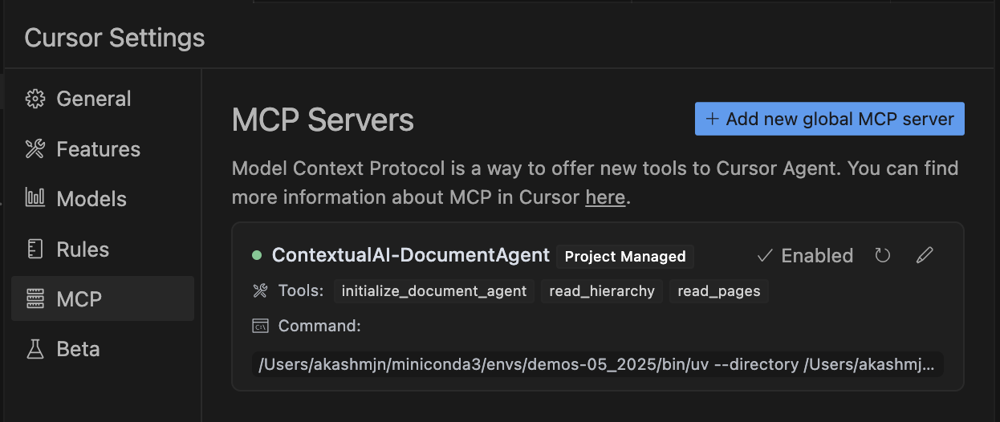

# Document Agent MCP Server

A specialized MCP server that provides document navigation and comprehension capabilities using Contextual AI's parsed documents.



## Overview

The Document Agent allows you to:
- Get AI-powered document comprehension through Cursor IDE
- Navigate document hierarchies with structured table of contents
- Read specific pages or sections of parsed documents  
- Initialize documents using the `/parse` job ID from [Contextual AI](https://app.contextual.ai/akash-contextual-ai/components/parse)

## Quick Setup

### 1. Prerequisites
- Python environment with 3.10+, following [this](../README.md)
- `uv` package manager
- Cursor IDE
- Contextual AI API key
- Document parsed through [Contextual AI's `/parse` component](https://app.contextual.ai/akash-contextual-ai/components/parse)

### 2. Environment Configuration

Create a `.env` file in the contextual-mcp-server directory:
```bash
API_KEY=your_contextual_ai_api_key_here
```
Get the path to your `uv` binary using `which uv` (e.g. /Users/username/miniconda3/envs/envname/bin/uv)

### 3. Cursor Integration

Add to your `.cursor/mcp.json`:
```json
{
 "mcpServers": {
   "ContextualAI-DocumentAgent": {
     "command": "/path/to/your/uv",
     "args": [
       "--directory",
       "/path/to/contextual-mcp-server",
       "run",
       "document-agent/server.py"
     ]
   }
 }
}
```


## Key Components

### `server.py`
Main MCP server with three core tools:
- `initialize_document_agent(job_id)` - Switch between documents
- `read_hierarchy()` - Get document outline and structure  
- `read_pages(rationale, start_index, end_index)` - Read specific page ranges

### `document.py` 
Contains `ParsedDocumentForAgent` class that wraps Contextual AI's parse output for easy navigation:
- Document hierarchy extraction
- Page-based content retrieval
- Section-based reading capabilities

## Usage Examples

```python
# In Cursor, ask questions like:
"Initialize document agent with job ID abc-123"
"Can you give me an overview of the document with page numbers"
"Can you give me a summary of the parts of the document talking about US government debt?"
```

**Note:** Job IDs are obtained from Contextual AI's [parse component](https://app.contextual.ai/akash-contextual-ai/components/parse) after uploading and processing your documents.

The server comes pre-loaded with sample documents including:
- US Government Financial report 2024 (247 pages)
- Bondcap AI report (340 pages)

## Development

To extend functionality, add new `@mcp.tool()` decorated functions in `server.py`. The tools automatically become available in Cursor through the MCP protocol.
