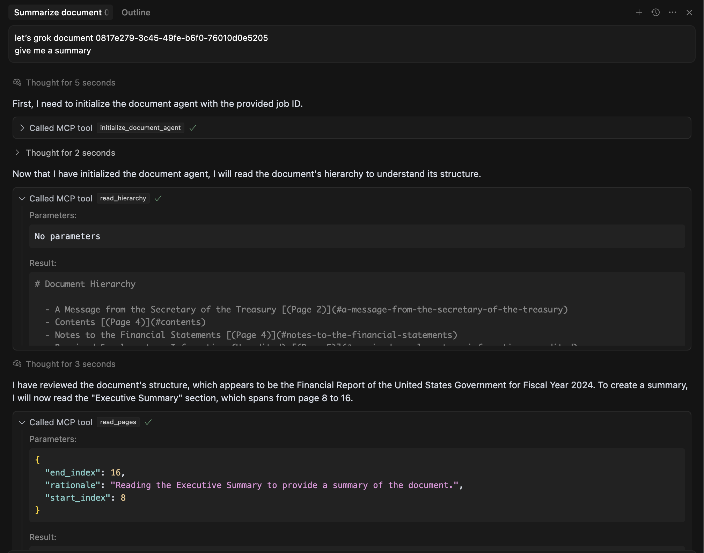

# Document Agent MCP Server

An MCP server to enable agents to understand and navigate large, complex documents with agentic RAG tools enabled by the Contextual AI [/parse API](https://docs.contextual.ai/api-reference/parse/parse-file).

This is a prototype showing how to:
- Get document comprehension right in Cursor (or any MCP client) with purely function calls
- Ask more complex queries than possible with naive RAG
- Get interpretable attributions via tool call traces as the agent navigates a document



**Note:** For faster iteration/caching, documents are referenced by Job IDs obtained from Contextual AI's [/parse API](https://docs.contextual.ai/api-reference/parse/parse-file) after they've completed processing. The demo uses [US Govt Financial Report FY2024](https://www.fiscal.treasury.gov/files/reports-statements/financial-report/2024/01-16-2025-FR-(Final).pdf).


## Quick Setup

A quick overview of steps needed to get started:
1. Setup your local python environment with `uv`
    1. Follow [this](../README.md#installation) to create an env and install dependencies
2. Create a `.cursor/mcp.json` file
    1. See details below on the config file and enable it in Cursor following [this](https://docs.cursor.com/context/model-context-protocol)
3. Get a Contextual AI API key
    1. Add it to a `.env` file in your Cursor workspace as `CTXL_API_KEY=key-XX`
4. Submit a `/parse` job with your document to get a job ID
    1. Use `uv run submit_parse_job.py "FILE_OR_URL"`


### MCP JSON config file

Get the path to your `uv` binary using `which uv` (e.g. /Users/username/miniconda3/envs/envname/bin/uv)

Add to your `.cursor/mcp.json`:
```json
{
 "mcpServers": {
   "ContextualAI-DocumentAgent": {
     "command": "/path/to/your/uv",
     "args": [
       "--directory",
       "/path/to/contextual-mcp-server",
       "run",
       "document-agent/server.py"
     ]
   }
 }
}
```

This can be configured for use with other MCP clients e.g. [Claude Desktop](https://modelcontextprotocol.io/quickstart/user).


## Key Components

### `server.py`
Main MCP server with three core tools:
- `initialize_document_agent(job_id)` - Switch between documents
- `read_hierarchy()` - Get document outline and structure  
- `read_pages(rationale, start_index, end_index)` - Read specific page ranges

### `document.py` 
Contains `ParsedDocumentNavigator` class that wraps Contextual AI's parse output for easy navigation:
- Access Document hierarchy as a kind of [llms.txt](https://llmstxt.org/) file
- Page-based content retrieval

## Usage Examples

```python
# In Cursor, ask questions like:
"Initialize document agent with job ID abc-123"
"Can you give me an overview of the document with page numbers"
"Can you summarize parts of the document about US government debt?"
```


## Development

To extend functionality, add new `@mcp.tool()` decorated functions in `server.py`. Refer to [this](../README.md#development) for more. 


## Extensions

This is a simple prototype to show agentic RAG using purely function calls made possible by the document structure inferred by `/parse` API. In practice, combining this pattern with text/semantic retrieval using [Contextual AI datastores](https://docs.contextual.ai/user-guides/beginner-guide) will allow scaling context for your agent to a corpus with 10-100x more such documents, while supporting complex synthesis and summarization.
